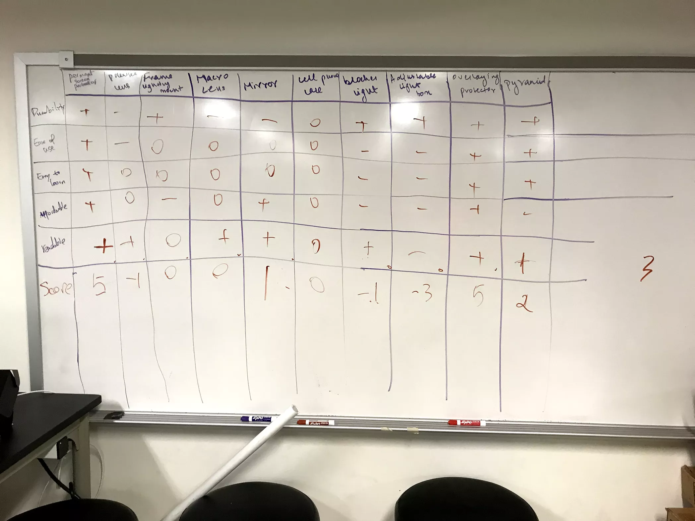
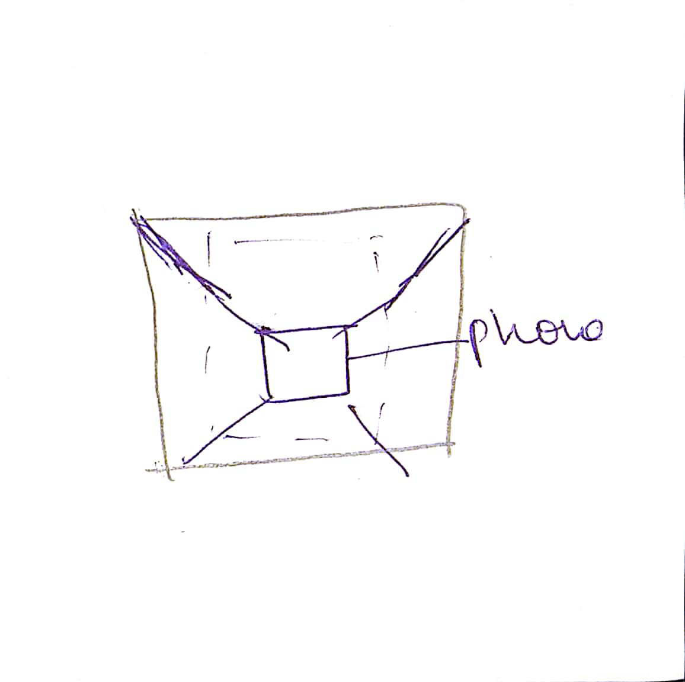
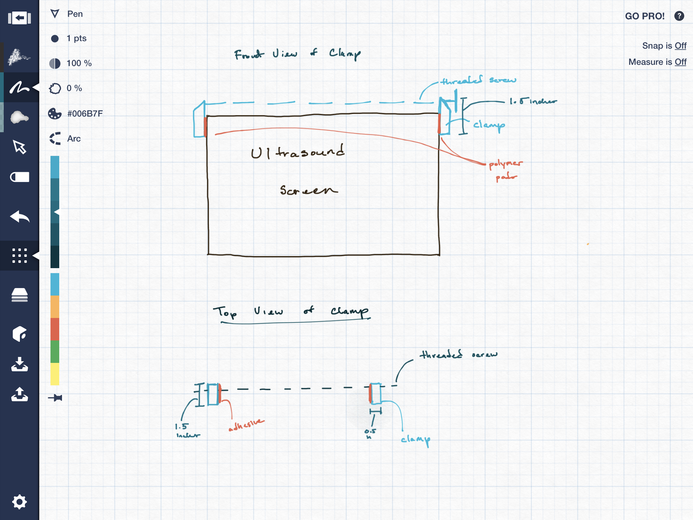
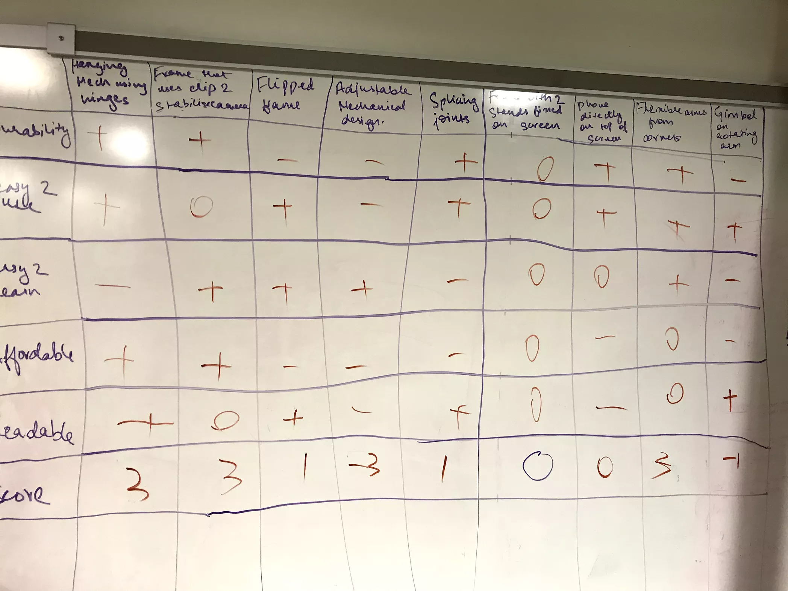
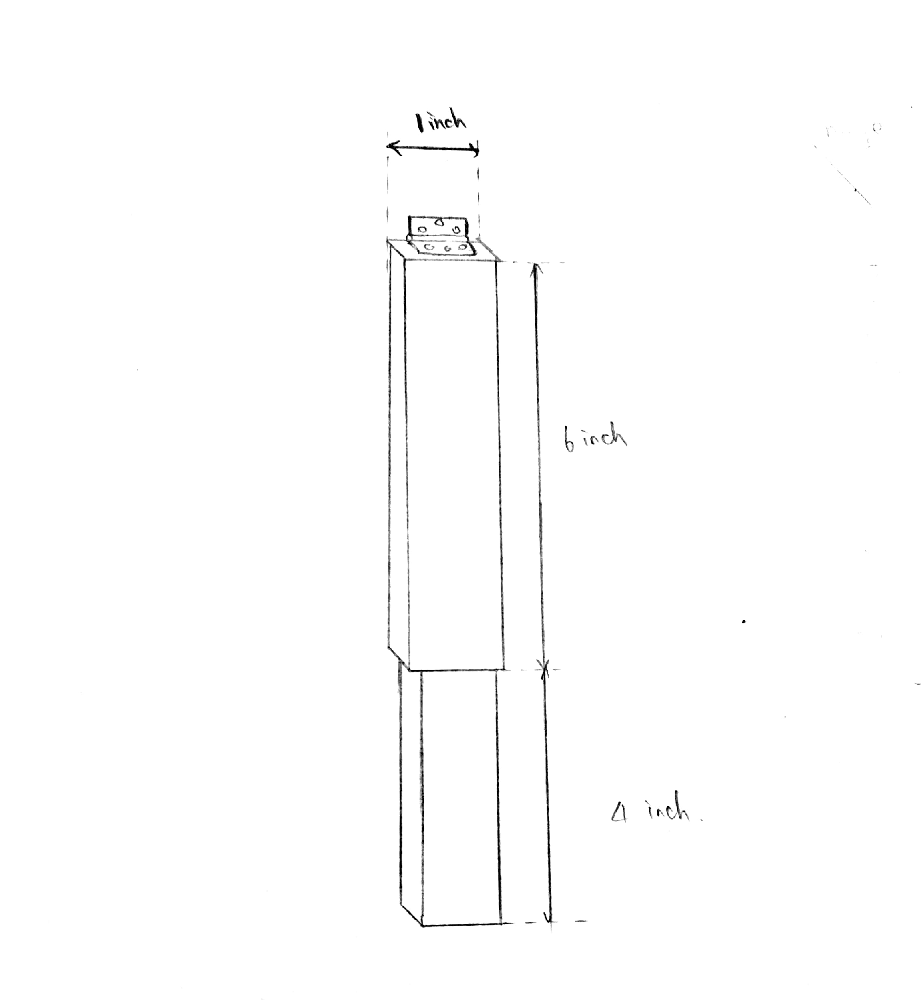
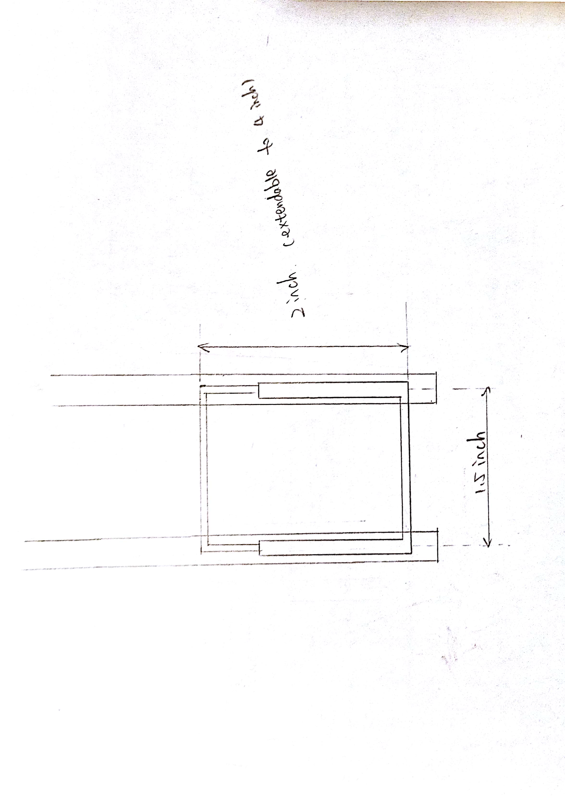

> **DATE: September 22, 2017**
> 
> **TO: Dr. Wettergreen **
> 
> **FROM: Age of Ultrasound (ageofultrasound@gmail.com)**
> 
> **SUBJECT: Brainstorming for Ultrasound Capturing Device Solutions**
> 
> **Overview of Brainstorming Process**
> 
> In order to find ideas for our design challenge, we took the main
> areas that we researched about phone cameras and thought of possible
> solutions. Since we are improving the quality of the image, anything
> that potentially reduced glare, made the phone more stable, changed
> exposure, limited noise or artifacting in the photo was considered. We
> used the Writing Slip method to brainstorm ideas within our team and
> hitch-hiked off of each other’s ideas. The brainstorming process took
> about 2.5 hours for our team to complete. Also we looked at potential
> complete design solutions instead of individual components of a
> solution.

**Light Control and Anti Glare Solutions**

  - > Change the angle between camera and screen

  - > A film for the ultrasound screen that decreases the amount of
    > glare

  - > Dark or polarized lens for camera

  - > A frame, with adequate lighting, mounted on ultrasound machine to
    > provide equal lighting on the screen (Figure 1)

  - > Capture image from reflection of a mirror or glass which is
    > attached to the ultrasound machine (resembles the anti-glare
    > display solution in museums) (Figure 2)

  - > Cell phone case that has lights around to provide adequate
    > lighting

  - > A box/frame that blocks light from the outside environment

  - > A box/frame with an adjustable slit that can control the amount of
    > light that come through the top/sides

  - > Different configurations of the box to change the amount of light
    > coming through

  - > Creating a specific area within the room with adequate amount of
    > lighting that optimises picture quality

  - > Overlaying different matte screen protectors with light filters on
    > top of the screen to mitigate CRT issues

  - > Using a pyramid shape with clips for the phone and screen to
    > prevent excess items from appearing in the photo

**Phone Stabilizing Attachments**

  - > Hanging mechanism using hinges attached to ultrasound
    > machine(Figure 3)

  - > Frame that uses a clip to stabilize camera phone (Figure 4)

  - > Frame that can be flipped over ultrasound machine when not in use
    > (Figure 5)

  - > An movable, adjustable mechanical design for attaching camera and
    > using it to focus on ultrasound screen (Figure 6)

  - > Frame design with splicing joints (Figure 7)

  - > Frame design with only two stand fixed to the bottom of the screen
    > (Figure 8)

  - > Screen capturing solution with phone directly mounted on the top
    > of ultrasound screen (Figure 9)

  - > Frame with flexible stands from four corners of the screen (Figure
    > 10)

  - > Frame design with spring system (resembles the spring system in
    > umbrellas)

  - > Cell phone case resembling the one worn on belt

  - > Gimbel on top of a rotating arm that folds behind the screen to
    > allow for lateral and vertical movement of the camera

**Manual/Peripheral Devices for Capturing Better Quality Images**

  - > Adjusting screen brightness

  - > Tilting screen away from light sources

  - > Written instructions for user on how to take better photos

  - > Tripod/quadripod stand to stabilize the phone

  - > Gimbal to allow the phone to be moved around by the operator but
    > also stabilize the photo

**Direct Transmission of Pictures from Machine to Phone**

  - > Wireless server attached to ultrasound machine

  - > Digital transfer unit, splicing the output of the ultrasound
    > machine to a laptop

  - > Webcam that relays images back directly to a phone, or a video
    > stream

  - > Scanner placed on the ultrasound screen

  - > A dental X ray machine-like design which uses a mobile phone
    > attached to it to capture image

  - > A specialised ultrasound camera to relay images to a phone

**App Based Enhancement**

  - > GIF Creator application for android device motion capture

  - > Android application to solely detect light of the ultrasound
    > machine and excludes other light sources

  - > Application for clicking a long exposure photograph such as those
    > used to take city photos

  - > An application which combines rapidly taken images to form a short
    > video

  - > Phone software that might enhance image quality and improve
    > contrast, like the application CamScanner

  - > Combining and overlaying multiple photos on top each other and
    > combining the best elements to form a single or multiple images

  - > Using filter settings on the normal android camera app

  - > Application that reads and records numbers from the ultrasound,
    > and send the data that conveys the full picture in numbers only

  - > Changing ISO and aperture settings on the camera app to control
    > amount of light that enters the camera

  - > App that crops and refocuses the best parts of the ultrasound
    > image

**Appendix: Design Scratch**

Figure 1: Mounting design that provides equal light

Figure 2: Capture image from reflection of a mirror or glass

Figure 3: Mechanism to hang mobile phone using hinges to fold out and
hook

Figure 4: Frame design with a phone clip

Figure 5: Frame design that can be flipped over machine

Figure 6: Adjustable frame design

Figure 7: Frame design with splicing joints

Figure 8: Frame design with bottom stands

Figure 9: Capturing solution with phone mounted on top of the screen

Figure 10: Frame design with flexible stands
