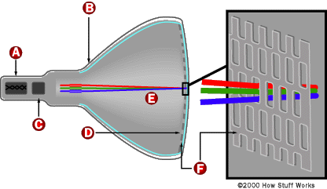

**DATE: September 18, 2017**

**TO: Dr. Wettergreen**

**FROM: Age of Ultrasound (ageofultrasound@gmail.com)**

**SUBJECT: Design Context Review Outline for Ultrasound Capturing
Device**

**Existing Solutions to Ultrasound Image Capturing**

After initial research, we found that there were a variety of ultrasound
solutions available and being applied in low resource regions. From
app-based solutions to machines that could plug into a smartphone,
ultrasound systems have countless forms that are being applied in
developing regions to diagnose conditions and issues. The most common
practices now that are similar to our issue are laptop-based ultrasound
machines as well as phone-based machines which would allow the clinics
to send the actual file to specialists to analyze. \[17\] These
solutions are beyond the scope of our design challenge because the
ultrasound machines being used in the target clinics are already
equipped with older machines which are not being replaced. These
variants of machines solve other problems such as needing the machines
to be simple to use so that trained individuals can easily operate them,
being portable, and being able to directly transfer files, but none
address the case of having to take a photo via a cell phone. Since these
solutions no longer apply to the scope of our challenge we looked into
taking photos of cathode ray tube (CRT) screens and moving objects.
Issues like glare, screen distortion, refresh rate, and exposure were
the most common problems and generally they were solved by changing the
physical placement of the camera or post processing.

**Previous Ultrasound Solutions for Low Resource Countries**

  - No ultrasound machine were available at clinics.

  - Standard, non-mobile machines which fall under the scope of our
    design challenge.
    
      - Standard non-mobile machines have no connection to mobile phones
        or laptops, so the file extraction process is taking a photo of
        the screen.

**Current Solutions for Low Resource Countries**

  - Using a video converter and iCam to have real time transmission of
    the ultrasound image to a specialist who can perform a diagnosis.
    
      - iCam is an IOS application that allows individuals to monitor
        webcam feeds or other media feeds remotely. \[8\]

  - Specialty ultrasound machine that was designed to use a telephone
    line as an output which can allow for remote diagnosis.
    
      - Only had a lag time of 2-6 seconds \[16\]

  - Cheap portable ultrasound machines
    
      - GE Vscan, GE Venue 40, Sonoscape A6, GE Logiq E (All are
        portable machines)\[27\]

  - Only notable differences between a phone image of an ultrasound and
    the actual raw file were a difficulty in reading measurements. No
    statistical significance in image quality, detail, and resolution.
    
      - This information highlights the fact that a main struggle with
        reading these mobile phone images is from the measurements on
        the screen being unreadable. \[1\]

**Similar Mobile Phone Based Solutions**

  - Cell-phone based imaging is being used as a solution to recording
    particles in microfluidic channels in order to determine densities
    and diagnose. \[2\]

  - App based communities such as *Figure-1* have been used to allow
    medical specialists from around the world to post and look at other
    medical imaging files so that they can diagnose or provide insight
    to help one another.

**Various Methods for Taking Images of Ultrasound**

  - CRT screens depend on refresh rate to show the image/video, and they
    refresh from top to bottom. If the refresh rate on the camera is
    different from the refresh rate of the screen, banding appears on
    the image of the screen and distorts the image.
    
      - Matching the refresh rate of the camera to the screen will
        remove the banding as both refresh at the same rate.
        
          - Specifically, the refresh rate of the camera should be
            slower than the refresh rate of the screen, preferably 2 or
            3 times slower (1/25th of a second)

  - Rotating the camera (not changing the angle) or taking the photo out
    of focus can remove the moire effect from the image.
    
      - Moire effect is a kind of blur from the arrays of color from the
        screen.

  - Ultrasound screens are mostly black so they are under-exposed. To
    adjust for the natural underexposure of the ultrasound image,
    increasing the brightness before taking the photo or in post
    processing will compensate for it.
    
      - When artificially increasing brightness, do not light from the
        same angle as you are taking the photo. Instead position it at
        the opposite angle.

  - Focusing on the white parts of an image can mitigate the strange
    color casting in the viewfinder of the phone.

  - Noisy photos: excessive dots in the photo can be a result of low
    lighting. Introducing a background light to the photo can help but
    it varies from setup to setup.

  - Fixing the camera to make a more stable photo. Simple fixes like
    making the camera stable allows for a better photo of subjects on a
    screen because it eliminates excessive movement.
    
      - Simple gimbals and phone tripods can be used to stabilize the
        shot

  - Using a macro lens for the phone or camera being used to take a
    photo can enhance the detail presented on the screen

**Problems with the Existing Ultrasound Capturing Solutions**

  - The current methods and practices being used to capture the
    ultrasound image via mobile phone are ineffective. The existing
    solution for our design challenge is taking a picture via cell phone
    and that process has too many issues.
    
      - Blur and noise from background objects appear in the image of
        the ultrasound
    
      - Poor lighting and focus can make the image hard to read
    
      - The measurements on the ultrasound are difficult to understand
    
      - Banding appears in photos of ultrasounds displayed from CRT
        screens

**Background, Business Perspective and Regulations: Foundations and
Goals of the Project**

Ultrasound machines have had tremendous breakthroughs in the last few
decades. Earlier machines were bulky, heavy and tedious to work with,
while devices now are smaller and have higher up to 5x more clarity than
earlier models(B models). We also plan to model our design specifically
around Android phones, as our research shows that our target markets
have a large population of Android phone users.\[22\] Based on current
markets, and most popular used android phones in developing countries,
the phones being tested are T-Max Butterfly, Swipe Konnect 5.1, and the
Huawei Honor Bee. We are working with a camera range of 8-13 megapixels,
which is what most mid tier-android phones have. We also do not have a
business model as a foreseeable goal for this project, as the
distribution is client controlled. No patents exist for a device like
ours, although some patents exist for analogous solutions. Compliance
with standards and regulations will be a major factor as we move forward
as all our target markets have similar yet differently nuanced
regulations governing medical devices.

**Domain and Preliminary Research**

  - Vscan Machines
    
      - Vscan Machines\[13\] are General Electric created portable
        ultrasound machines for use in low resource regions of the
        world. They are smaller, and have far more capabilities than
        previous B-models(older generation ultrasound machines). \[2\]

  - Design Basis
    
      - Some material objectives include using non-porous, non-magnetic
        materials that are easily sanitizable and withstand temperatures
        of up to 70 degree Celsius (due to lack of regulated clinic
        temperature and heat needed to sanitize).
    
      - Since the project is expected to be built as an addition to a
        mobile device, it is important to understand how widely
        available mobile phones are in these regions which is shown in
        Table 1. Mobile penetration is the percentage of people
        connected through mobile phones of the total population of the
        region.

**Table 1**: **Number of Active Users and Mobile Penetration in Target
Regions**

|               |                        |                                   |
| ------------- | ---------------------- | --------------------------------- |
| **Region**    | **Mobile Penetration** | **Number of Users (in millions)** |
| India         | 68%                    | 615                               |
| Latin America | 65%                    | 300                               |

  - Android Phones: To have a better assessment of the technology being
    used in low resource regions, we searched for the most commonly used
    phones in low-resource regions. Most of the phones in these regions
    had low megapixel cameras. The cameras are described in Table 2.

**Table 2**: **Features on Common Phones utilized in Low Resource
Countries**

|                   |                          |                   |                           |                         |                        |                           |                  |
| ----------------- | ------------------------ | ----------------- | ------------------------- | ----------------------- | ---------------------- | ------------------------- | ---------------- |
| **Phone Brand**   | **Screen Size (across)** | **Total Pixels** | **PPI (pixels per inch)** | **Camera (megapixels)** | **LED Flash (Yes/No)** | **HD Recording (Yes/No)** | **Price (USD$)** |
| T-Max Butterfly   | 4.0 in (10.16cm)         | 480x800 px        | 233 PPI                   | 5 MP                    | Yes                    | Yes                       | $30              |
| Swipe Konnect 5.1 | 5.0 in (12.7cm)          | 480x854           | 196 PPI                   | 8 MP                    | Yes                    | No                        | $55              |
| Huawei Honor Bee  | 4.5 in (11.43cm)         | 480x854           | 218 PPI                   | 8 MP                    | Yes (Dual)             | No                        | $60              |

**Potential Users**

  - Clinic workers:
    
      - Young and old medical professionals with limited technical
        knowledge to evaluate ultrasound images on-site but good
        knowledge of point of care treatment administration.
    
    <!-- end list -->
    
      - They also know how to click pictures with android phones, due to
        their popularity in low resource countries. The phones are well
        connected through internet.
    
      - They are able to use and attach/detach any external mechanical
        devices to an ultrasound machine.

**Business Model for Our Design**

  - There is limited scope of a business model in our project, as
    distribution is controlled by clients.

  - We have identified cost as a major constraint, and are hoping to
    build our device within a budget of USD $15. However, our maximum
    cost cannot exceed USD $50, as our target markets are low resource
    areas. We are competing with effectively a USD $0 solution (clicking
    pictures through phones).

  - Distribution and marketing would most likely be through specialists
    that advice clinics in low resource regions.

  - Patents for ultrasound data transfer devices are generally highly
    software based, and due to cost limitations aren’t applicable.

**Applicable Physics Principles**

  - We will have to utilise principles of luminous intensity, depth of
    field to create sharp images, and pixels.
    
      - Luminous intensity is the wavelength weighted power emitted by a
        light source in a particular direction per unit solid angle.
        \[20\]
    
      - Pixels are units of programmable color on an image or display or
        the smallest controllable element of a photo on a screen.

**Standards and Regulations in The Target Markets**

  - Regulations in India have stringent specifications on the use of
    ultrasound and restrict ultrasound use to primarily immobile
    machines. Portable solutions are not allowed and only radiologists
    who have been certified may use ultrasound machines.\[10\]
    
      - Ultrasound machines cannot be moved from a center to another
        without registration

<!-- end list -->

  - Some international (U.N.) regulations are present but these specify
    to the privacy of an individual, not necessarily any guidelines for
    ultrasounds or medical data. \[12\]\[19\]

  - Similarly in Colombia, political conflict has limited use of PoC
    solutions for ultrasound due to specialists not wanting their job to
    be lost to ultrasound becoming accessible to more individuals. \[6\]
    
      - In recent years, regulations for the radiology community have
        been changing and restrictions have been implemented which
        guarantee a certain level of safety and quality.

**Screens Utilized by Ultrasound Machines**

  - Ultrasound monitors either use a CRT screen or liquid crystal
    display (LCD) screens.
    
      - Newer machines utilize LCD screen due the better quality and
        faster refresh rate.
    
      - A cathode ray tube screen consists of a cathode (heated
        filament) in a glass enclosed vacuum, anode, and a conductive
        coating\[26\]. Figure 1 gives illustration of the process.

**Figure 1 - Inside a Cathode Ray Tube \[26\]**

  - Photographing of Ultrasound Machines
    
      - Adjustment of camera shutter speed, ISO, refresh rate, and
        aperture\[24\]
        
          - The ISO is how sensitive the film is to light
            
              - The lower the ISO the more lighting must be present when
                taking the photograph.
        
          - The shutter speed is the duration of time the shutter is
            open on the camera.
        
          - The aperture is the size of the hole where light will go
            through.
        
          - The refresh rate is the rate at which the picture refreshes
            on the screen. This can generally be found in the manual for
            the screen.

**Manufacturing Considerations**

  - Basic recommendations dictated by client

  - Fundamental requirements of medical devices used in operating room
    
      - Electrical Insulation
    
      - Temperature Resistance Recommendations
    
      - Thermoplastics

**References**

> 1\. Blaivas, Michael, Matthew Lyon, and Sandeep Duggal. 2005.
> "Ultrasound Image Transmission Via Camera Phones For Overreading".
> *The American Journal Of Emergency Medicine* 23 (4): 433-438.
> doi:10.1016/j.ajem.2004.09.037.
> 
> 2\. Boppart, S. A., and R. Richards-Kortum. 2014. "Point-Of-Care And
> Point-Of-Procedure Optical Imaging Technologies For Primary Care And
> Global Health". *Science Translational Medicine* 6 (253):
> 253rv2-253rv2. doi:10.1126/scitranslmed.3009725.
> 
> 3\. Corr, Peter, and Fikri M Abu-Zidan. 2017. "Clinical Ultrasound
> Physics". *Pubmed Central (PMC)*.
> https://www.ncbi.nlm.nih.gov/pmc/articles/PMC3214508/.
> 
> 4\. DeStigter, Kristen. 2017. "Low-Cost, Sustainable Solution For
> Rural Ultrasound Imaging, Transmission And Diagnosis". *Changemakers*.
> https://www.changemakers.com/morehealth/entries/low-cost-sustainable-solutions-rural-ultrasound-imaging.
> 
> 5\. Hall, Fred M., Gerard A. Hranek, Lloyd B. Kreuzer, Lawrence T.
> McNary, Mary Jeanne Rabold, David A. Rock, and Rex A. Timbs. 2001.
> "Ultrasound Image Information Archiving System". U.S.
> https://www.google.ch/patents/US6253214
> 
> 6\. Henwood, Patricia C, David Beversluis, Alissa A Genthon, Christina
> N Wilson, Brendan Norwood, Daniel Silva, and Mark Foran et al. 2014.
> "Characterizing The Limited Use Of Point-Of-Care Ultrasound In
> Colombian Emergency Medicine Residencies". *International Journal Of
> Emergency Medicine* 7 (1): 7. doi:10.1186/1865-1380-7-7.
> 
> 7\. "Jack Imaging". 2017. *Jack Imaging*.
> https://beta.jackimaging.com/provider\#2ndopinions\_marker.
> 
> 8\. Liteplo, Andrew S., Vicki E. Noble, and Ben Attwood. 2010.
> "Real-Time Video Transmission Of Ultrasound Images To An Iphone".
> *Critical Ultrasound Journal* 1 (3): 105-110.
> doi:10.1007/s13089-010-0025-4.
> 
> 9\. Luo, Ligang, Liping Li, Jiajia Hu, Xiaozhe Wang, Boulin Hou,
> Tianze Zhang, and Lue Ping Zhao. 2016. "A Hybrid Solution For
> Extracting Structured Medical Information From Unstructured Data In
> Medical Records Via A Double-Reading/Entry System". *BMC Medical
> Informatics And Decision Making* 16 (1).
> doi:10.1186/s12911-016-0357-5.
> 
> 10\. Mani, Sanjeev. 2012. "Guidelines For Ultrasound Owners And Owners
> Of Clinics, Diagnostic Centres, Nursing Homes And Hospitals". *Indian
> Journal Of Radiology And Imaging* 22 (2): 125.
> doi:10.4103/0971-3026.101102.
> 
> 11\. McDonald, Omid. 1999. "System And Method For Storing And
> Displaying Ultrasound Images". U.S.
> https://www.google.ac/patents/US8224419
> 
> 12\. *Protecting Data Privacy In Health Services Research*. 2000.
> Washington, D.C.: National Academy Press.
> 
> 13\. Rao, Pavithra, and Dona Joseph. 2017. "Africa Wired: Portable
> Ultrasound Device To Tackle Child Mortality | Africa Renewal Online".
> *Un.Org*.
> http://www.un.org/africarenewal/magazine/december-2016-march-2017/africa-wired-portable-ultrasound-device-tackle-child-mortality.
> 
> 14\. Ross, Andrew B., Kristen K. DeStigter, Matthew Rielly, Sonia
> Souza, Gabriel Eli Morey, Melissa Nelson, Eric Z. Silfen, Brian Garra,
> Alphonsus Matovu, and Michael Grace Kawooya. 2013. "A Low-Cost
> Ultrasound Program Leads To Increased Antenatal Clinic Visits And
> Attended Deliveries At A Health Care Clinic In Rural Uganda". *Plos
> ONE* 8 (10): e78450. doi:10.1371/journal.pone.0078450.
> 
> 15\. Sippel, Stephanie, Krithika Muruganandan, Adam Levine, and
> Sachita Shah. 2011. "Review Article: Use Of Ultrasound In The
> Developing World". *International Journal Of Emergency Medicine* 4
> (1): 72. doi:10.1186/1865-1380-4-72.
> 
> 16\. Sublett, J.W., B.J. Dempsey, and A.C. Weaver. 2017. "Design And
> Implementation Of A Digital Teleultrasound System For Real-Time Remote
> Diagnosis". *Proceedings Eighth IEEE Symposium On Computer-Based
> Medical Systems*. Accessed September 16. doi:10.1109/cbms.1995.465413.
> 
> 17\. "Telehealth: Remote Healthcare - April 2016 - HCMS Group". 2017.
> *HCMS Group*.
> http://www.hcmsgroup.com/telehealth-remote-healthcare-april-2016/.
> 
> 18\. van Velthoven, Michelle Helena, Nikolaos Mastellos, Azeem Majeed,
> John O’Donoghue, and Josip Car. 2016. "Feasibility Of Extracting Data
> From Electronic Medical Records For Research: An International
> Comparative Study". *BMC Medical Informatics And Decision Making* 16
> (1). doi:10.1186/s12911-016-0332-1.
> 
> 19\. Vreeland, Amy, Kenneth R. Persons, Henri Primo, Matthew Bishop,
> Kimberley M. Garriott, Matthew K. Doyle, Elliott Silver, Danielle M.
> Brown, and Chris Bashall. 2016. "Considerations For Exchanging And
> Sharing Medical Images For Improved Collaboration And Patient Care:
> HIMSS-SIIM Collaborative White Paper". *Journal Of Digital Imaging* 29
> (5): 547-558. doi:10.1007/s10278-016-9885-x.
> 
> 20\. *Calculating Illuminance And Luminous Intensity*. 2017. Ebook.
> Sharp.
> http://www.sharp-world.com/contents/calculator/support/program/pdf/el9900/Cal\_06\_EL9900.pdf.
> 
> 21\. "Lighting Principles And Terms | Department Of Energy". 2017.
> *Energy.Gov*.
> https://energy.gov/energysaver/lighting-principles-and-terms.
> 
> 22\. Metha, Ivan. 2017. "Xiaomi Is Now The Second Highest Selling
> Smartphone In India". *Huffington Post India*.
> http://www.huffingtonpost.in/2017/05/01/timely-launches-places-xiaomi-on-the-second-spot-of-indian-smart\_a\_22063007/.
> 
> 23\. Orenstein, Beth W. 2017. "Ultrasound History".
> *Radiologytoday.Net*.
> http://www.radiologytoday.net/archive/rt\_120108p28.shtml.
> 
> 24\. *Photographic Lenses And Optics*. 1994. Oxford: Focal.
> 
> 25\. "The Feynman Lectures On Physics Vol. II Ch. 38: Elasticity".
> 2017. *Feynmanlectures.Caltech.Edu*.
> http://www.feynmanlectures.caltech.edu/II\_38.html.
> 
> 26\. Marshall Brain "How Television Works" 26 November 2006.
> HowStuffWorks.com. \<http://electronics.howstuffworks.com/tv.htm\> 17
> September 2017
> 
> 27\. Portable Ultrasound Machines - KPI Healthcare
> <http://www.kpiultrasound.com/best-ultrasound-machine/portable-ultrasound-machines/>
> 
> 28\. WTF Just Happened: My Computer Monitor Looks Awful on Camera
> Tim Moynihan -
> <https://www.wired.com/2014/08/wtf-just-happened-my-computer-monitor-looks-awful-on-camera/>
> 
> 29\. Piazza, Tim. “Why do pictures of screens look weird?” *Quora*, 14 Feb. 2017, www.quora.com/Why-do-pictures-of-screens-look-weird. Accessed 23 Sept. 2017.
> 
> 30\. What's the best way to take a picture of an LCD or CRTscreen?
> <https://photo.stackexchange.com/questions/21294/whats-the-best-way-to-take-a-picture-of-an-lcd-or-crt-screen>
> 
> 31\. How to best take a picture of a screen, like a computer monitor, with a phone camera?
> https://photo.stackexchange.com/questions/24871/how-to-best-take-a-picture-of-a-screen-like-a-computer-monitor-with-a-phone-ca
