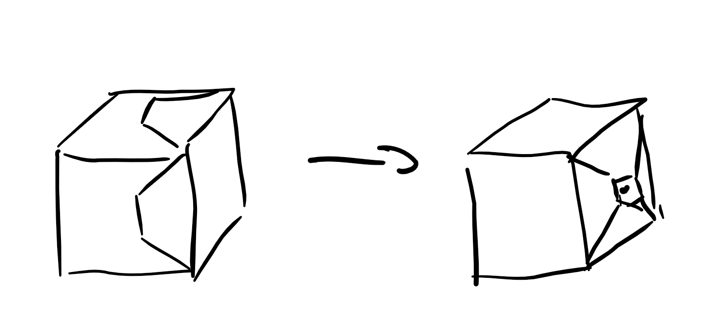
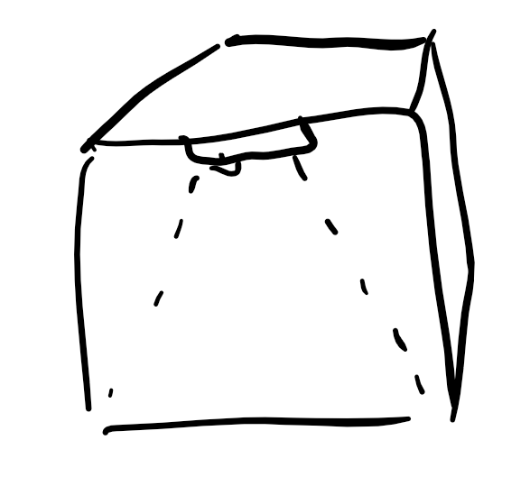
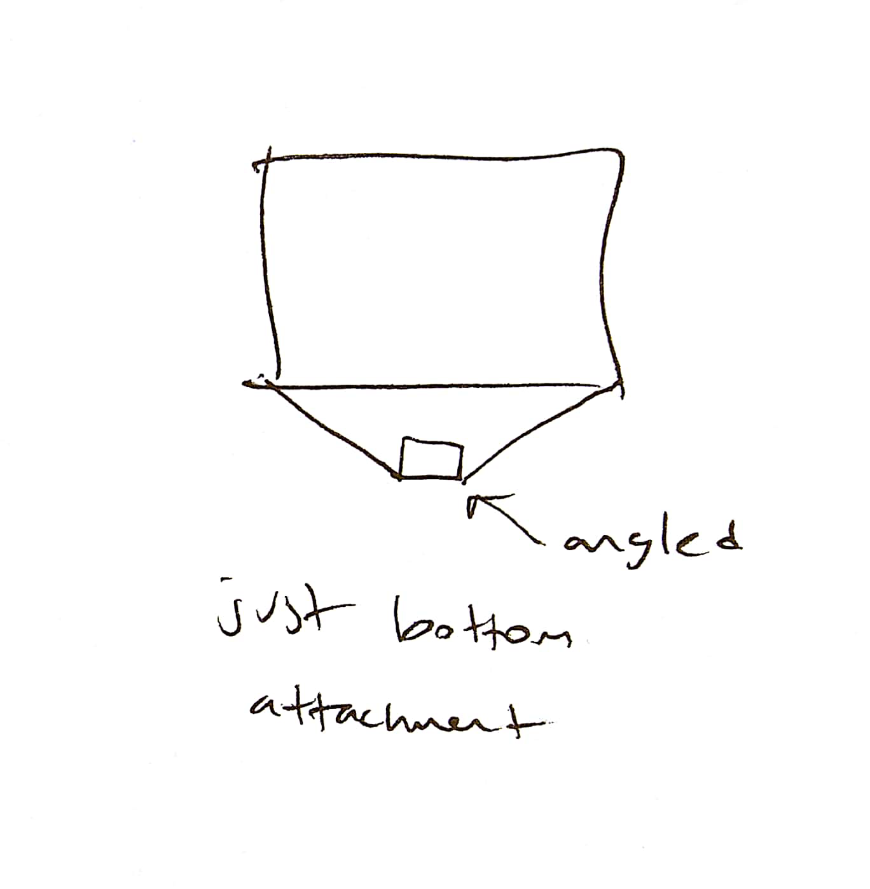

**DATE: December 9, 2017**

**TO: Dr. Wettergreen **

**FROM: Age of Ultrasound (ageofultrasound@gmail.com)**

**SUBJECT: Design Solution for Ultrasound Capturing Device**

**Lack of Specialists but Presence of Ultrasound Machines in Low
Resource Regions**

In low resource regions there is a lack of ultrasound specialists who
are able to diagnose conditions from ultrasound imaging. This is an
issue because ultrasound imaging is vital to diagnosing conditions such
as microcephaly in Zika infected regions. Currently healthcare workers
are taking photos of the ultrasounds and sending them offsite to
specialists who then make a diagnosis and relay that analysis to the
worker. Using the current method to take these photos, the images often
suffer from glare, artifacting, extraneous components like surroundings
in the image, and poor lighting. The objective of our design problem is
to create a physical device that will improve the quality of images
captured of ultrasound screens through reducing glare and stabilizing
the phone. Our design solution is a stabilizing variable frame for
stability, along with a polarizing lens attached to the phone camera and
an MXH film screen protector to reduce glare in the image.

**Current Status of Design Solution**

Our final prototype is a high fidelity solution that comprises of a
stabilizing frame that can be flipped on top of the ultrasound machine,
a screen protector that attaches to the ultrasound screen, and a
polarising lens that can be attached to the phone camera. The final
prototype is a primarily 3D printed assembly made from PLA filament with
additional pre-manufactured components. The variable stabilizing frame
(includes linear slides, linear slide holders, horizontal stabilizing
component, and vertical adjustable arms) is 3D printed to be able to
adjust the design as needed and leave the possibility of open sourcing
the solution. In addition to the stabilizing frame, a 4 inch phone clamp
and a 16 inch bar clamp are needed to mount the design to any ultrasound
machine. The materials used for the anti-glare component were a
commercially available MXH screen film (16 inch diagonal), and a
variable polarizing lens. To complete the assembly we used a 1 ⅛ inch
bolt, as well as ~10 mL of epoxy to secure the assembly.

**Testing and Results for Easy to Learn**

To test Easy to Learn, we had originally planned to collect responses
from healthcare workers via Google Forms based on the Used Defined Scale
shown in Table 2. We would then ask each worker to try and learn how to
use the device based on a given set of instructions before answering
their perceived level of ease of use on a 1-5 point scale according to
the User Defined Scale. Originally, because this is a constructed test
using standard measurements, our goal is to repeat the test 10 times.
However, due to time constraints, we were only able to obtain
evaluations from our client (who is a physician and has extensive
knowledge on the project), as well as an ultrasound technician. Based on
this data we were able to reasonably estimate the effectiveness of our
device in low resource countries. We scored a 4, and therefore passed
our Easy to Learn design criteria.

**Testing and Results for Readability**

To test readability, we used the MATLAB image processing toolkit to
measure the grayscale value of a photograph. The goal of this test is to
identify whether our solution reduces the average grayscale value of the
matrix by comparing the average grayscale value of an image with and
without our solution. We defined a passing score for this readability
test to be greater than or equal to 10 between the scores of our control
and experimental values. This value indicated that the image has
reduction in glare and artifacting, as most of the glare color values
are around 255 which skew the average of the grayscale of the image
higher. Our testing showed that our solution reduced glare by a
differential of 16, thereby passing our test.

**Testing and Results for Anti-Glare**

To measure how much of the image is glare free, the design team took
images of ultrasounds in different lighting conditions and then measure
how much of the image was free of artifacting and glare by area of the
total image. The goal for the criteria is 85% of the image is glare
free. The test was done by the design team and was run 5 times on the
same image in different lighting conditions. The result of this test was
95% of the image was glare-free, thereby passing our test.

**Testing and Results for Easy to Use**

To test Easy to Use, we used a timer to measure time taken to set up the
apparatus. Because the goal of this test is to measure the time taken to
set up the device regularly after initially learning how to set it up,
we will first teach every test subject how to set up the device and
allow them to practice until they are confident that they know how to
set up the device. Then a team member will time each subject to measure
the amount of time they used to set up the device. Originally, because
this is a constructed test using standard measurements, we will repeat
the test 10 times. However, due to a lack of time we were only able to
obtain evaluations from our client. Based on this data we were able to
reasonably estimate the ease of use of our product by the workers who
will be using them.

**Testing and Results for Durability**

To test durability, the final device should be able to withstand 5 drops
from 5 feet. 5 feet was chosen as the drop height because it is the
approximate height of ultrasound machines placed on tables in a clinical
setting. The measurement was made by having a team member simply drop
the device onto a flat cement area, 5 times. Since the device is
expected to be attached to the ultrasound machine, 5 drops are
representative of the maximum impact force onto the device. This test
also accounts for any minor accidents that come from either the machine
falling from the system, or someone bumping into the product. Due to the
nature of this test, the trials were conducted by team members, and
observations were recorded and used to improve the product. Measurements
were taken for number of structural defects that impair the use of the
device. The composite design solution failed the durability test on the
second drop. However, after individually testing the components we found
that only one part(linear slide) failed while all other parts passed
with no noticeable scratches or dents in the assembly. Upon this result
the single part was adjusted (and strengthened with adjustments to the
3D print), and testing was repeated with successful trials 5 times.
Therefore even though our composite assembly failed to meet the design
criteria, all of our individual components passed our test for
durability.

**Testing and Results for Cost of Material**

For cost of material, we totaled the material cost in US dollars,
excluding labor and time costs. Only 1 trial was needed as the
measurement is both direct and standard. The measurement was done by a
team member by cross referencing purchase receipts. The goal cost was
$15; however, we would still qualify the test with a cost up to $50 as
defined by our client. Our design costs $61.73 at store rates. If we
mass produce the design solution, at a scale of 1000 units, we expect a
total cost of $23.34 per unit which would pass the threshold of $50
maximum per unit.

**Strengths and Limitations of the Current Assembly**

Through testing the design against our design criteria and constraints,
we found that our solution increases the readability of the ultrasound,
can be affordable if it is mass produced or open sourced, is relatively
durable, and to the extent of our testing should be easy to use. The
limitations of our design are that the MXH/MXG films needed to reduce
glare are the most cost-prohibitive part of our design, our linear slide
holder components are the weakest part of our design, and the initial
setup of our design is not as easily done as we envisioned. Further our
variability encompasses most ultrasound machines but struggles to
accommodate machines with very thin screens or with taller aspect
ratios.

**Appendix**

**Table 1: Tests and Results Solutions for Design
Objectives**

| **Design Criteria **        | **Method of Measurement**                                    | **Number of Repetitions**                                          | **Test conductor **                             | **Criteria/Variable Measured**                                                    |
| --------------------------- | ------------------------------------------------------------ | ------------------------------------------------------------------ | ----------------------------------------------- | --------------------------------------------------------------------------------- |
| **Easy to Learn**           | Use questionnaire based on User Defined Scale                | 10                                                                 | Healthcare workers                              | User Defined Scale (1-5)                                                          |
| **Grayscale: Readability**  | Use MATLAB Image Analysis Toolkit to measure grayscale value | Once every image for 5 images and a final consultation with client | Design team                                     | Average grayscale value derived from the matrix of gray values of the image taken |
| **Readability **            | Panel of Specialists                                         | 5                                                                  | Design team                                     | Improved image/more readable image                                                |
| **Anti-Glare: Readability** | Measure the area of the photo that is artifact free          | Once every image, for 5 different images                           | Design Team                                     | Percent of whole screen                                                           |
| **Easy to Use**             | Use timer to measure time taken to set up apparatus          | 10                                                                 | Same group of healthcare workers as Easy to Use | Time (seconds)                                                                    |
| **Durability**              | Drop test from 5 feet                                        | 5                                                                  | Design team                                     | Number of Structural Defects                                                      |
| **Cost of Material**        | Calculate the combined cost of material in USD               | 2                                                                  | Design team                                     | Cost in USD ($)                                                                   |

**Table 2: Testing
Results**

| **Design Criteria **        | **Goal**                                        | **Testing Data**         | **Result**     |
| --------------------------- | ----------------------------------------------- | ------------------------ | -------------- |
| **Easy to Learn**           | 4 or higher on user defined scale               | 4                        | Satisfactory   |
| **Grayscale: Readability**  | Average grayscale value difference more than 10 | 16                       | Satisfactory   |
| **Readability **            | Image improved judged by specialist             | Image quality improved   | Satisfactory   |
| **Anti-Glare: Readability** | More than 85% glare free                        | More than 95% glare free | Satisfactory   |
| **Easy to Use**             | Take less than 5 minutes to set up              | 3 minutes to set up      | Satisfactory   |
| **Durability**              | Survive 5 drop test from 5 feet                 | Failed on 2nd drop       | Unsatisfactory |
| **Cost of Material**        | Less than 15$                                   | $23.34                   | Unsatisfactory |

**Table 3: Components of Design
Solution**

| **Component**                        | **Function**                                                         | **Material**       | **Dimensions**               |
| ------------------------------------ | -------------------------------------------------------------------- | ------------------ | ---------------------------- |
| **Bar Clamp**                        | Provide a point of fixation on the ultrasound machine                | Plastic and metal  | Clamp length: 17 inches      |
| **Linear Slide Holder**              | Hold linear slide and connect to bar clamp                           | PLA plastic        | 6 x 1 x 1 cubic inches       |
| **Linear Slide**                     | Provide horizontal adjustability for the design                      | PLA plastic        | 6 x 1 x 1 cubic inches       |
| **Horizontal Stabilizing Component** | Stabilize and connect two parallel linear slides                     | PLA plastic        | 6 x 0.65 x 0.65 cubic inches |
| **Vertical Adjustment**              | Provide vertical adjustability for the phone placement               | PLA plastic        | 6 x 0.5 x 0.8 cubic inches   |
| **Horizontal Clamp Mount**           | Provide a horizontal connection point for mounting the phone clamp   | PLA plastic        | 7.25 x 1 x 0.5 cubic inches  |
| **Adjustable Phone Clamp**           | A clamp to attach phone to the design                                | Plastic            | 1 x 0.8 x 0.5 cubic inches   |
| **Polarized Lens**                   | A lens that attaches to the camera of the phone used to reduce glare | Plastic and glass  | 2 inch diameter              |
| **Screen Protector**                 | Reduce glare                                                         | MXH                | 12 inches x 8 inches         |
| **Connections**                      | Keep components connected                                            | Epoxy & steel bolt | ~10mL                        |

**Diagrams and Drawings**

**Figure 1: Testing Design Solution**

**Figure 2: Design Solution with Labeled
Components**

**Figure 3: Design Solution using CAD**

**Figure 4: Linear Slide**

**Figure 5: Linear Slide Holder**

**Figure 6: Vertical Adjustment Component**

**Figure 7: Horizontal Clamp Mount**

**Figure 8: Horizontal Stabilizing Component**

**Video Summary of Design**

<https://www.youtube.com/watch?v=zmbGnVgQm0k>
