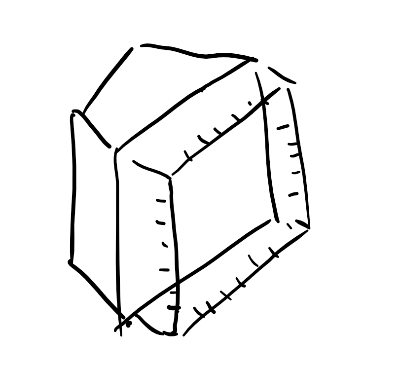
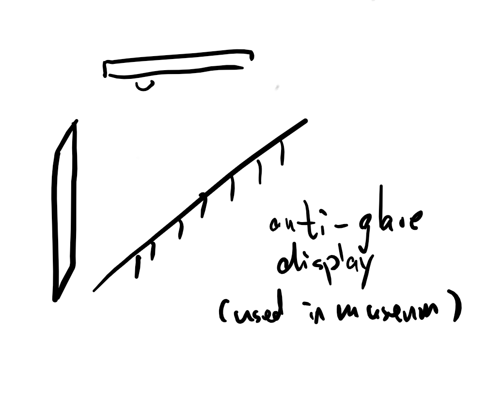
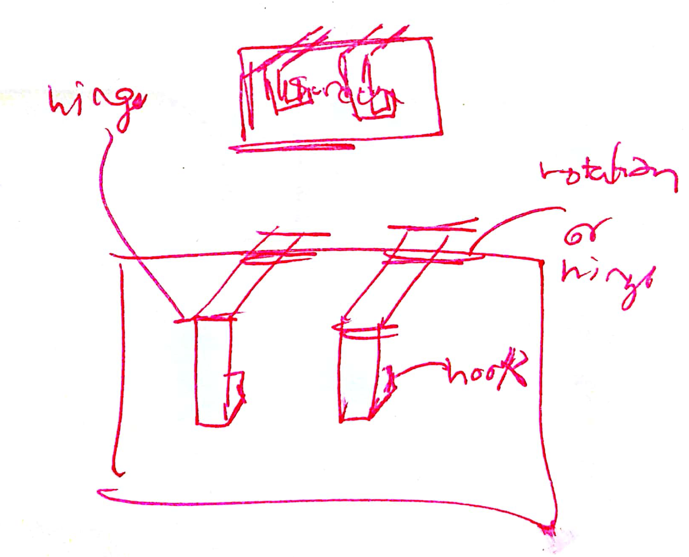
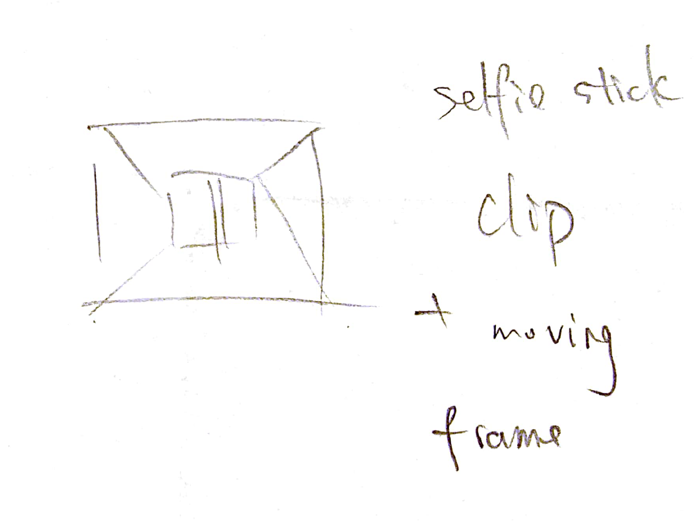
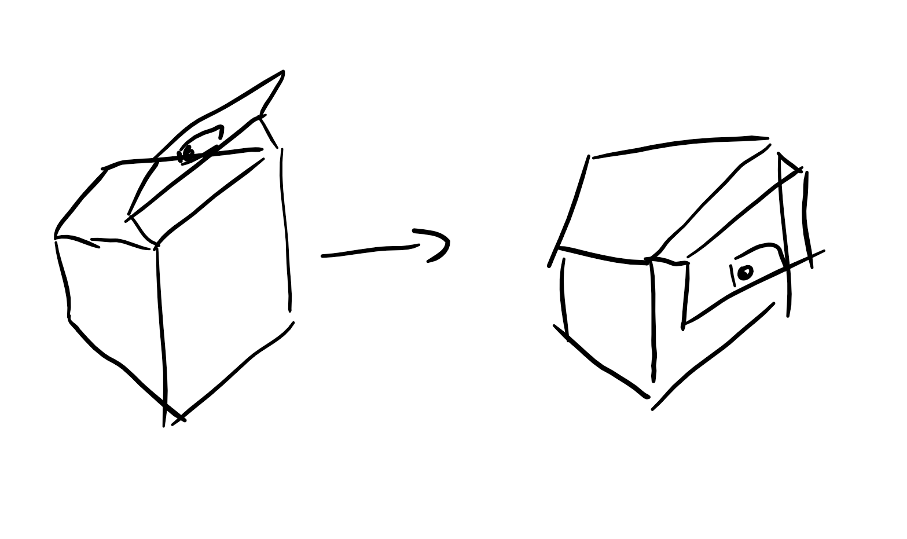
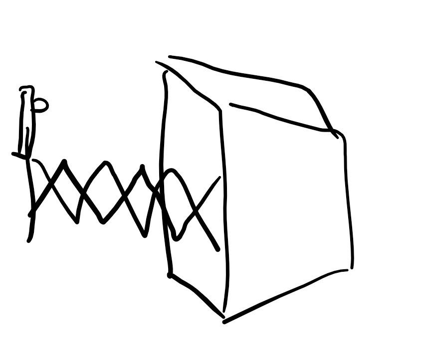
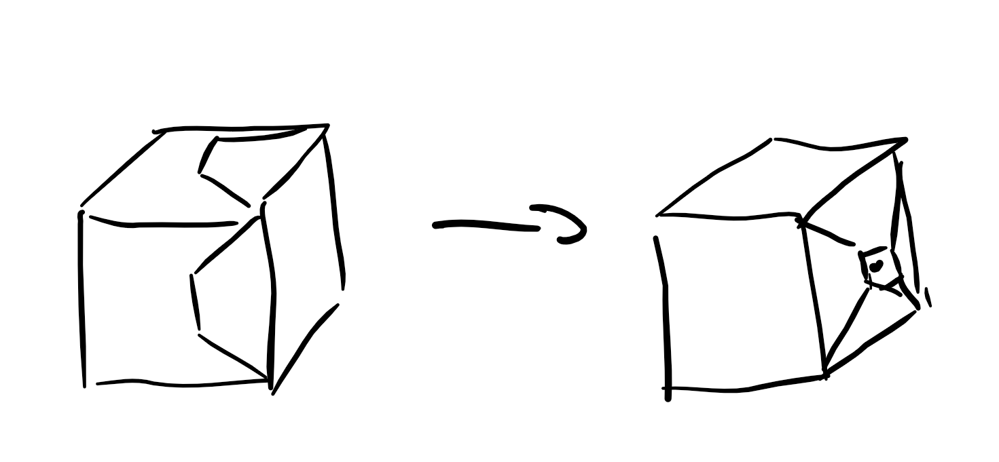
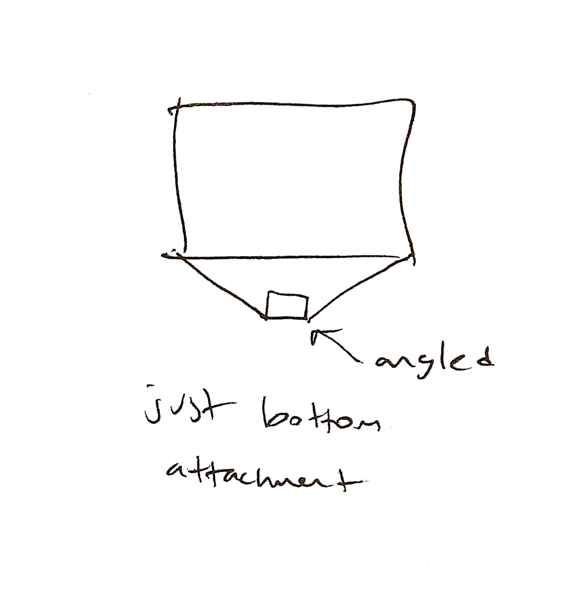
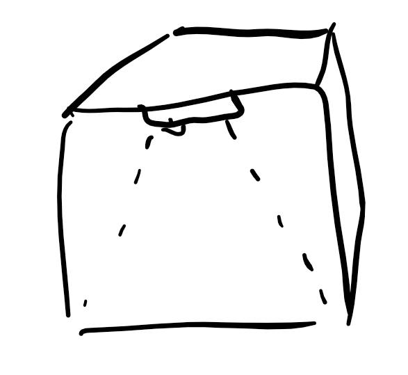

> **DATE: October 14, 2017**
> 
> **TO: Dr. Wettergreen **
> 
> **FROM: Age of Ultrasound (ageofultrasound@gmail.com)**
> 
> **SUBJECT: Prototypes and Final Design Specifications for Ultrasound
> Capturing Design**
> 
> **Variants of the Flipped Frame with Polarizing Lens and Screen
> Protector**

The design goal for our project is to develop a physical device that can
improve the quality of ultrasound photos taken by stabilization and
anti-glare mechanisms. After deliberation with our clients and through
our decision matrices, the chosen solution is a frame that can be
attached to the top of an ultrasound screen, which is able to flip out
to hold a mobile device and attaches a lens to the camera of the phone.
On the ultrasound machine itself, this design solution also includes an
anti-glare screen protector which can be fit to any ultrasound screen
with the maximum dimensions of 15 inches in diameter. Within this
solution we have three variants that we are prototyping. All of them
include the flipped frame, but implement differing combinations of the
screen protector and the lens. The flipped frame consists of a clamp
that will attach to the frame of the ultrasound screen, a hinge that
will allow the frame holding the phone to rotate back for storage, and a
variable length frame that can adjust the distance away from the screen
through a linear slide mechanism (Figure 1).

**Component: Clamp and Hinge for Ultrasound Machine Screen**

The clamp for the mechanism is the anchor for supporting it from the
edge of the screen (Figure 2). The adjustable clamp will be made out of
resin/plastic with polymer pads on the ends of the clamps so they will
stick to the screen. The polymer pads are soft and stick so they can
attach to any surface as well as increase the strength of the clamp.
Each side of the clamp is 1.5 x 1.5 x 0.5 inches (including the adhesive
foam) and can contract to a width of 5 inches and extend to 18 inches
between the two sides of the clamp. On the side opposite of the open end
of the clamp, two hinges will be placed in the middle such that when
they open up, the arms attached to the hinges lock out where the arm is
perpendicular to the clamp. The two hinges used would be 1.5 inch metal
hinges.

**Component: Variable Arm Extending from Clamp**

The variable arm extending from the clamp will be made from
prefabricated polyvinyl chloride (PVC) plastic. Using two pieces of
plastic we will inlay a piece of 6 x 0.5 x 0.5 inch plastic into a
larger section of 6 x 1 x 1 inch plastic creating a linear slide like
mechanism. This will allow the arm to move closer or further from the
ultrasound screen depending on the size of the ultrasound screen and the
situation (Figure 3). These measurements were made assuming the largest
screen size would be 15.6 inch diagonally which was reflected from our
earlier research and meetings with Dr. Cortes and her contacts.

**Component: Vertical Arm Holding Mobile Device**

The vertical arm that will hold the mobile devices is made from two key
components: vertical arm and phone clamp. Two plastic prisms similar to
the ones used in the horizontal arm except with dimensions of 3 x 0.5 x
0.5 inch (Figure 4). Attached to the vertical arm is a plastic clamp
used with dimensions of 1.5 inch by 2 inch (with the 2 inch side
extendable to 4 inch), using epoxy. This vertical arm allows for
vertical movement of the phone and the adjustable clamp allows any sized
phone to be fit properly and securely.

**Component: Clamp with Lens Fastening Phone to Device**

The clamp with lens will hold a polarizing lens (1x magnification) over
the camera portion of the phone. The lens will be imbedded in one leg of
the clamp (Figure 5). Two legs of the clamp will be joined together with
a metal spring. The clamp leg will be 3 inches long to fit different
lens positions due to varying positions of the camera on a phone. The
clamp is similar to that on a selfie stick and can be commercially
sourced.

**Component: Adjustable Screen Protector**

The adjustable screen protector is made from a 16 inch diagonal matte
plastic adhesive sheet that is available commercially (Figure 6). This
screen protector fits the maximum size screen and can be adapted to any
size by cutting the excess away from the perforations provided on the
screen protector itself.

**How the Components Work as a Whole**

To fit the components together, we start with the clamp. The hinges at
the top of the clamp attach to the variable arm extending from the clamp
in such fashion that when the variable arm is at the maximum point of
the hinge, it is perpendicular to the clamp. The vertical arms are then
fastened to the horizontal arms such that they are perpendicular and
would be glued with epoxy or connected with a tightened hinge for small
angular movement. The clamp for the phone is already attached to the
vertical arms via epoxy and the lens is attached onto the phone clamp
(Figure 1). The screen protector attaches to the screen of the
ultrasound machine itself.

**Low Fidelity Prototypes**

We developed two basic low fidelity prototypes using popsicle sticks,
clothespins, pipe cleaners, paper clips, masking tape, and miniature
plastic clamps (Figure 7-9). The 1st prototype used clothespins and
popsicle sticks along with pipe cleaners so that it could be very
flexible while the 2nd prototype took a more rigid route and used mini
plastic clamps with tape and popsicle sticks to create a rigid frame
that only held up its own weight. The problems with our prototypes were
that there was not enough structure to hold weight as they barely held
up their own weight and that they did not properly address the
readability constraint as we could not hold up the design far enough
from the screen for a phone to hypothetically take the desired photo.

**2 Week Plan for Prototyping **

Starting from October 12th, we created a plan to complete two prototypes
by October 20th. We developed a process to prototype and evaluate
quickly so that we could test numerous low fidelity variations of our
selected solution (Figure 10).

Figure 10: Two-week Plan

**Appendix**

Figure 1: Side View Assembly Sketch of the Complete Solution

Figure 2 : Top View of Clamp Design for the Ultrasound Machine Screen

Figure 3: Front View of Clamp Design for the Ultrasound Machine Screen

Figure 4: Top View of Horizontal Variable Arm from Clamp

Figure 5: Front View of Vertical Adjustable Arms and Phone Clamp

Figure 6: Side View of Polarizing Lens Clamp for Phone

Figure 7: Front View of Adjustable Screen Protector for Ultrasound
Machines

**Low Fidelity
Prototypes**

Figures 8,9: Low Fidelity Prototype 1

Figure 10: Low Fidelity Prototype 2
