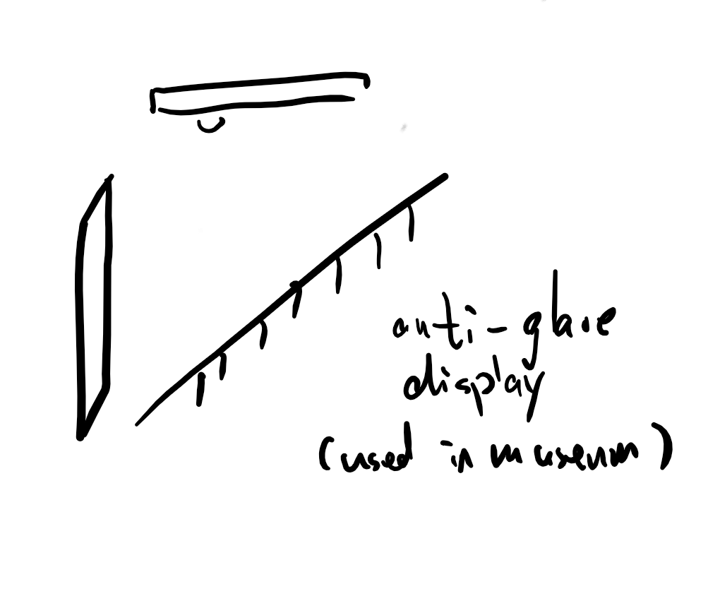

**DATE: November 4, 2017**

**TO: Dr. Wettergreen**

**FROM: Age of Ultrasound (ageofultrasound@gmail.com)**

**SUBJECT: Prototyping Timeline for Ultrasound Capturing Design**

**Prototyping Timeline Overview**

The design goal for our project is to develop a physical device that can
improve the quality of ultrasound photos taken by stabilization and
anti-glare mechanisms. After deliberation with our clients and through
our decision matrices, the chosen solution is a frame that can be
attached to the top of an ultrasound screen, which is able to flip out
to hold a mobile device and attaches a lens to the camera of the phone.
On the ultrasound machine itself, this design solution also includes an
anti-glare screen protector which can be fit to any ultrasound screen
with the maximum dimensions of 15 inches in diameter.

In the following month, our team will create two medium fidelity
prototypes and one final high fidelity prototype. We will complete the
first medium fidelity prototype by November 1st and the second medium
fidelity prototype by November 14th. Our final prototype will be
finished by November 28th. In each prototyping process, our team will
order necessary materials, create or edit CAD models of the prototype,
build and combine all design blocks, and evaluate the prototypes. Our
timeline for the next month is displayed in the Gantt chart below (Table
1).

**Table 1: Prototyping Gantt Chart**

**Overview of the Upcoming Three Prototypes to be Constructed**

By the time of our final deadline, we will have two medium fidelity
prototypes and one high fidelity prototype. The first medium fidelity
prototype will be built with wood. This will include both vertical and
horizontal arms with a sliding mechanism that will be connected using
hinges. In addition, the anti glare protector will be ordered and
tested. During the process of constructing our wooden prototype, we will
begin developing CAD models of the vertical/horizontal arms with the
sliding mechanism. The second medium fidelity prototype will be 3D
Printed using the printers at the OEDK. CAD models that were started
during the first medium fidelity prototype will be edited and developed
to more complexity. These will then be 3D printed and assembled. The
third prototype (high fidelity) will be built based on how previous
prototypes work out. If the 3D printed prototype is functional and
efficient with our design, then final CAD editing will be performed.

**Prototyping Milestones**

In the following month, we have 9 deliverables in the form of technical
memos, presentations, and prototype evaluations.

Technical Memo 7 Version 1 will be completed by October 30, 2017 with
Shryans, Chuck, and Denizhan as authors. Technical Memo 7 Version 2 will
be completed by November 6, 2017 with Shryans, Chuck and Denizhan as
authors. Technical Memo 8 Version 1 will be completed by November 13,
2017 with Kunal and Denizhan as authors. Technical Memo 8 Version 2 will
be completed by November 11, 2017 with Kunal and Denizhan as authors.
Technical Memo 9 will be complete by December 9, 2017 with Denizhan,
Aaryan, and Chuck as authors.

Prototype Evaluation I will be performed with all of the team present on
October 31, 2017. Prototype Evaluation II will be performed with all of
the team present on November 14, 2017. Final Prototype Design and Oral
Presentation II - Our final prototype will be completed and a second
oral presentation will be prepared by November 28, 2017 with Denizhan,
Kunal, and Chuck as presenters. Final Prototype Evaluation - Our final
prototype evaluation will be performed with all of the team present on
December 9, 2017.

**Concurrents and Dependent Tasks**

**Concurrent Tasks:**

CAD models of our prototype will continue throughout our Prototype 1
development, which is not dependant on our CAD models. In addition,
client meetings will be held at irregular intervals as per the schedule
of the client. We will also be documenting our prototyping process
throughout and prototyping different design blocks concurrently. Work on
Technical Memos 7 and 8 will be due at November 6th and November 12th
respectively.

**Dependent Tasks:**

We will order materials for our next prototype before our current
prototype. This will allow us to work on the current prototype as well
as wait for ordered materials; Prototype 3 is dependent on materials we
order on October 27th, while the Final Prototype is dependent on the
materials we order on November 2nd. There will be make-up days before
every prototype, so that we may order any remaining materials we deem
necessary. All integration and combination tasks are dependent on the
completion of build tasks as we need the completed part to be able to
actually continue the building process. Prototype 2 will be integrated
by November 1st, Prototype 3 by November 15th and final prototype by
November 28th. Our prototype iterations are also dependent on test
results for the previous prototypes, and we have included additional
days to order more material if needed. For our final prototype, we have
November 15th and 16th to order these materials. Technical Memo 9 is
also dependent on our final prototype, which is due at the time of the
finals.

**Division of Labor**

Only Kunal has intermediate proficiency with CAD; Shryans and Aaryan
have limited proficiency of CAD. Therefore, they will be primarily
responsible for all CAD related tasks. This means that they will start
CAD designs on the computer while other members of the group begin
construction of the first prototype. Chuck and Denizhan will be
responsible for adequate documentation of the process. This will include
writing technical memo 7-9. The team will primarily work in groups of 2,
and the harder design blocks will be evenly divided over the course of
all three prototypes among everyone. Therefore, everyone has an equal
physical prototyping workload.

**Schedule Flexibility and Accountability**

Each sub team of our group is accountable to the other sub-team. This
ensures that there is always accountability. If possible, and if needed,
the members of a sub-team are free to contribute to another sub-team’s
work, and it will be actively encouraged. Weekly updates with client,
mentors and TA will also help us stay on schedule. The overarching goal
will be to try and finish tasks before deadlines, so that we have lag
times that we may utilize adequately for other tasks as necessary. If
the team falls behind schedule, we will utilize Saturday time, which is
currently free, to catch up schedule. There are also designated lag days
in our Gantt chart, marked with yellow boxes, that give us flexibility
and space to stay on schedule. Some such lag days are on November 22nd,
November 25th, November 11th and November 12th.
