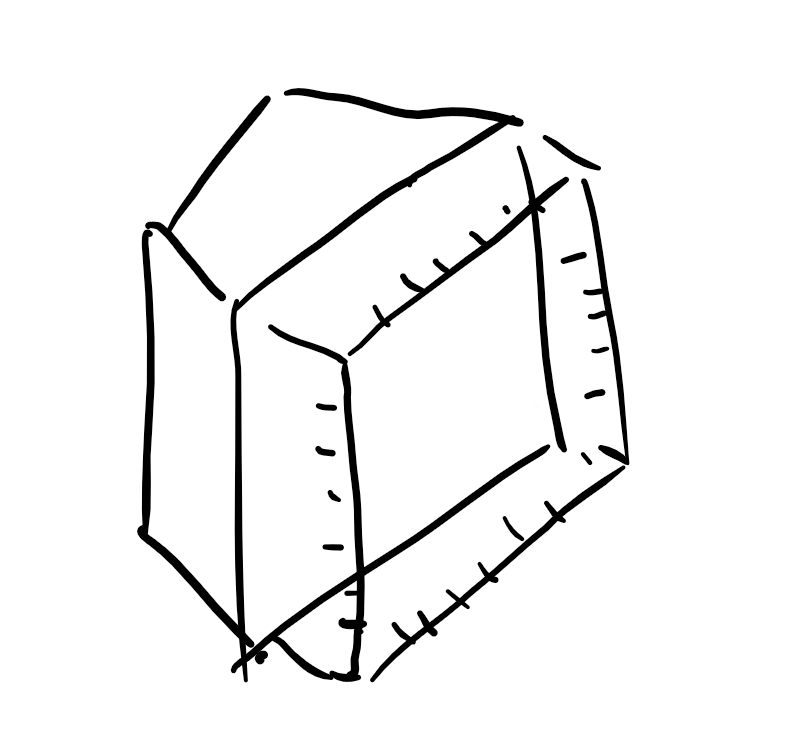

**DATE: November 10, 2017**

**TO: Dr. Wettergreen **

**FROM: Age of Ultrasound (ageofultrasound@gmail.com)**

**SUBJECT: Testing Methods for Ultrasound Capturing Device**

**Methods to Evaluate our Ultrasound Capturing Device **

We will be evaluating our design solution based on 5 key design
criteria. Our first design criteria is Easy to Learn, which evaluates
how intuitive the the design is for the user. It will be tested using a
User Defined Scale, with an target value of average higher than 4 on
User defined scale (Table 1). Readability is the criteria that assesses
how many different grayscale values we have in the image taken by the
solution. We will measure readability using Photoshop to accurately
measure the number of shades of gray present in the image of the
ultrasound, which must be greater than 100. For anti-glare, we will
measure the area of the photo that does not have any visual artifacting.
Since the criteria has a target value of \>80%, we will check this by
analyzing the photo and calculating percentage (by area) of the photo
that is glare free. Our third design criteria, Easy to Use, measures the
setup time of our device which must be shorter than 2 minutes to compete
with the existing solution, which is simply taking a photo with a phone
unassisted. We will use a timer or a stopwatch to measure the time it
takes to setup our device. Durability is defined by surviving 5 drop
tests at 5 feet each. Durability will be measured by performing drop
tests on our device, and our final design criteria, Material Cost, will
be measured by the number of dollars we needed to build the design.

**Table 1: Testing Solutions for Design
Objectives**

|                      |                                                              |                                                                     |                                                 |                                    |
| -------------------- | ------------------------------------------------------------ | ------------------------------------------------------------------- | ----------------------------------------------- | ---------------------------------- |
| **Design Criteria ** | **Method of Measurement**                                    | **Number of Repetitions**                                           | **Test conductor **                             | **Criteria/Variable Measured**     |
| **Easy to Learn**    | Use questionnaire based on User Defined Scale                | 10                                                                  | Healthcare workers                              | User Defined Scale (1-5)           |
| **Readability**      | Use MATLAB Image Analysis Toolkit to measure grayscale value | Once every image for 10 images and a final consultation with client | Design team                                     | Gray Scale Value                   |
| **Readability **     | Panel of Specialists                                         | 5                                                                   | Design team                                     | Improved image/more readable image |
| **Anti-Glare**       | Measure the area of the photo that is artifact free          | Once every image, for 10 different images                           | Design Team                                     | Percent of whole screen            |
| **Easy to Use**      | Use timer to measure time taken to set up apparatus          | 10                                                                  | Same group of healthcare workers as Easy to Use | Time (seconds)                     |
| **Durability**       | Drop test from 5 feet                                        | 5                                                                   | Design team                                     | Number of Structural Defects       |
| **Cost of Material** | Calculate the combined cost of material in USD               | 2                                                                   | Design team                                     | Cost in USD ($)                    |

**Test for Easy to Learn**

To test Easy to Learn, we are going to collect responses from healthcare
workers via Google Forms based on the Used Defined Scale shown in Table
2. We will ask each worker to try and learn how to use the device based
on a given set of instructions before answering their perceived level of
ease of use on a 1-5 point scale according to the User Defined Scale.
Because the test is constructed and surrogate, the test will be repeated
with 10 different individual subjects to get a representational result.
We choose other volunteer health workers at local hospitals as our test
subjects have a similar knowledge as the health care workers working in
these developing nations where the device will be implemented.

**Test for Readability**

To test readability, we are going to use the MATLAB image processing
toolkit to measure the grayscale value of a photograph. The goal of this
test is to identify if greater than 100 of the 256 grayscale values are
present. This will indicate that the image has a good variance and could
provide enough distinction for a specialist to make a diagnosis. The
specialist should be able to easily decipher between gray, white, and
black on the photograph. In addition to this test, our client has told
us that she can provide 5 specialists to review and test our solution.
What we will do is take 5 different ultrasounds and provide 2 photos,
one with our solution and one without. We will ask the specialists which
image is more readable and if the solution wins 3 out of the 5 times, we
will consider it a success.

**Test for Anti-Glare**

To be able to measure how much of the image is glare free, the design
team will take images of ultrasounds in different lighting conditions
and then measure how much of the image free of artifacting/glare by area
of the total image. The goal for the criteria is 85% of the image is
glare free. The test will be done by the design team and will be run 10
times on the same image in different lighting conditions.

**Test for Easy to Use**

To test Easy to Use, we are going to use a timer to measure time taken
to set up the apparatus. Because the goal of this test is to measure the
time taken to set up the device regularly after initially learning how
to set it up, we will first teach every test subject how to set up the
device and allow them to practice until they are confident that they
know how to set up the device. Then a team member will time each subject
to measure the amount of time they used to set up the device. Because
this is a constructed test using standard measurements, we will repeat
the test 10 times. We choose the same group of healthcare workers that
participated in the Easy to Learn test because the Easy to Learn test
provides the prior knowledge needed in this test. We choose other
volunteer health workers at local hospitals as they have a similar body
of knowledge as those working in these developing nations where the
device will be implemented.

**Test for Durability**

To test durability, the final device should be able to withstand 5 drops
from 5 feet. 5 Feet was chosen as the drop height because it is the
approximate height of ultrasound machines placed on tables in a clinical
setting. The measurement will be made by having a team member simply
drop the device onto a flat cement area, 5 times. The device is expected
to be primarily attached to the ultrasound machine, and 5 drops should
be representative of a the maximum force that would be impacted onto the
device. This test should account for any minor accidents that come from
either the machine falling from the system, or someone bumping into the
product. Due to the nature of this test, the trials can be conducted by
team members, and observations can be recorded and used to improve the
product. Measurements will be taken for number of structural defects
that impair the use of the device.

**Test for Cost of Material**

For cost of material, we will simply be totaling the material cost in US
dollars, this will not include labor and time costs. Only 1 trial will
be needed to be conducted as the measurement is both direct and
standard. The measurement will be taken by a team member simply through
cross referencing receipts. The goal cost is $15; however, we can still
pass this test with a cost up to $50.

**Gantt Chart Update**

According to the test designed for our device, we updated our Gantt
Chart to include the time slot for us to conduct each test. Each team
member will be responsible for conducting one test as shown in the Gantt
Chart (Figure 1).

Overall, our team is on time for our prototyping process, completed
tasks are marked green in the Gantt Chart. We are slightly late for
ordering materials for final prototype, but the order is placed and we
will still be able to receive our material before final prototype
begins.

**Appendix**

**Table 2: User Defined Scale for Easy to
Learn**

|              |                                                                |
| ------------ | -------------------------------------------------------------- |
| **Ranking ** | **Scale for Easy to Learn**                                    |
| 5            | Only requires a diagram to learn how to use                    |
| 4            | Requires step by step walkthrough                              |
| 3            | Requires multiple sets of instructions and diagrams to explain |
| 2            | Requires multiple people to understand how to setup            |
| 1            | Instructions and multiple people still unable to setup device  |

**Figure 1: Gantt Chart for Project Timeline**

**Figure 1 - continued: Gantt Chart for Project Timeline**
